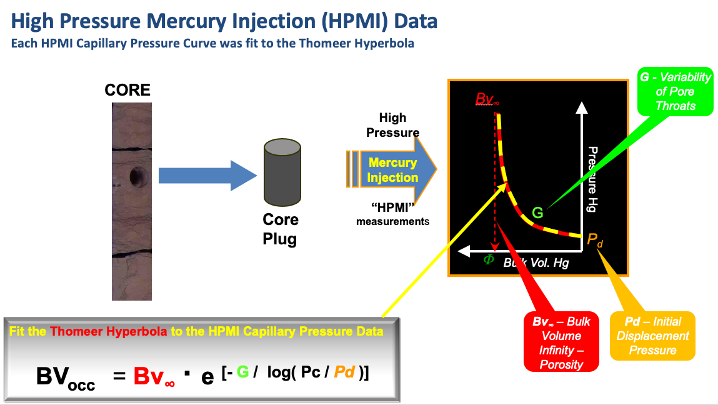
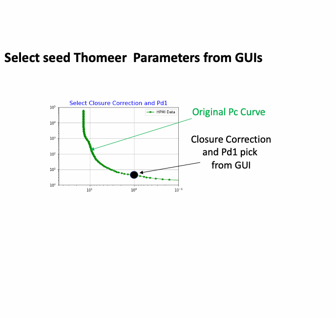

# Thomeer-Used-to-Model-High-Pressure-Mercury-Injection-Data
In this repository we provide the python code used to closure correct and estimate the Thomeer Capillary Pressure parameters used to model High Pressure Mercury Injection (HPMI) data using the Thomeer hyperbola.
---
### Updated January 24, 2022 with python 'try' implementation and calculations of error, Thomeer perm and Mode of Pore Thoat Distribution in Microns (diameter). There are now 3 samples that can be used, but the user needs to un-comment out the file name, number of pore systems, Sample Number and Closure Correction all on one line for the HPMI sample file that you want to try. We have added an option to create *.png image from the Final Plot too. 

### Right now our Thomeer Workflow has all of the Closure Corrections by sample as a constant called Closure. We think it is best to use a series of cross plots in Geolog or python matplotlib to pick this Closure Correction from the HPMI data up front before starting on the Thomeer Analysis of the HPMI data. The Closure Correction is given in the same line as the selection of the Sample file that you select. We also have a curve called NO_PORE_SYS that is used to instruct the Notebook as to how many pore systems to solve for in this process. In this Jupyter Notebook we also have an Automatic option (‘YES’,’NO’) that if Auto=‘NO’, then the program will allow you to make your own picks for the following:

      1) Pd1 (Closure Correction is already input as a curve). If Auto='YES', then Pd1 is automatically picked. 
      2) BV1 & Pd2 if there are 2 Pore Systems used in Auto = 'NO' or 'YES'.
      3) BVtotal if 2 Pore Systems in Auto = 'NO'.

### If Auto = 'YES' and your sample has 2 pore systems, then you would still need to pick Pd2 and BV1 from item #2 above.

### You can very easily add your own HPMI data Excel file(s) to the ./data subdirectory using the same format as the other samples, and add the file inputs to the Notebook in order to load the file(s).
---
## Introduction:
This GitHub repository uses python code to import High Pressure Mercury Injection (HPMI) Core data from Excel and then use a Thomeer hyperbola to model the Thomeer Capillary Pressure parameters as shown below. Ed Clerke used a similar method in Excel with Solver to estimate his Thomeer parameters for each HPMI sample that went into the Rosetta Stone Arab D Carbonate Thomeer database. His Excel spreadsheet is readily available, and a copy of this spreadsheet is included in this repository. We also used fminsearch in Matlab too, but now we can do this in python. We have used these types of software to build our own reservoir-specific core calibration databases in the past for our Reservoir Characterization studies.

## How it Works:
The following animated image illustrates how this software operates. We start with the original HPMI data. The first step is to locate the point on the HPMI curve that represents the point where real data begins and not the HPMI data representing surface conformance around the plug sample. We also select the Initial Displacement Pressure (Pd1) for the sample for the first pore system too. We find that most carbonate rocks have bi-modal pore throat distributions representing two pore systems as shown in the example below. The selection of this point is performed with just a click on the Graphical User Interface (GUI) where this occurs. 

For the second step we pick the point for the Bulk Volume porosity of the first pore system (BV1) as well as the Initial Displacement Pressure for the second pore system (Pd2).

The third step is to select the Total porosity for the HPMI data called BVtotal where the porosity of the second pore system is called BV2:

      BV2 = BVtotal - BV1

This program uses Scipy Optimize Curve_fit to estimate the appropriate Thomeer parameters necessary to model the HPMI data. The points selected from the GUIs are used to estimate boundary conditions for these estimations, and the estimations for this example are shown below:

    Thomeer Parameters Estimated from Imported HPMI Data:
        Pd1 = 8.67  ,  G1 = 0.54 , BV1 = 10.13
        Pd2 = 389.1 ,  G2 = 0.24 , BV2 = 4.8

## Reservoir Characterization Workflow:
We are using the HPMI data from just one sample for this example. Our objective will be to employ this program in Geolog as a python loglan. In Geolog we will read the Pc data in from the SCAL data stored in a well and write the results for each sample back to Geolog to build our sample-by-sample core calibration database. We would then use the carbonate characterization workflow as employed in our following GitHub repository but alter the workflow to employ our own new reservoir-specific calibration data for our reservoir characterization.

https://github.com/Philliec459/Geolog-Used-to-Automate-the-Characterization-Workflow-using-Clerkes-Rosetta-Stone-calibration-data

In the above workflows we have used hundreds of HPMI samples as calibration. In the image below we are showing the Porosity vs. Permeability cross plot in the upper left for all the calibration samples used in Ed Clerke's Rosetta Stone Carbonate Arab D reservoir study. The colors represent different Petrophysical Rock Type as determined by Clerke. We typically select a small group of poro-perm samples, and the Pc curves from this small group of selected samples is then shown in the lower left part of the figure. The black Pc curve is the upscaled Pc curve from the selected samples, and the black bars in the histograms represent the median value for the selected samples. In our saturation-height modeling we use the upscaled Pc curves that vary level-by-level because of the changing reservoir quality of the rock along the wellbore.

## Modeling of Saturations Using Thomeer Capillary Pressure Parameters: 
The following image shows one example from our modeling of saturations from Capillary Pressure vs. log analysis. The match is very good. I personally have performed this type of characterization on at least 30 huge carbonate oil fields in Saudi Arabia, and the results shown below are very typical.

---
1 Clerke, E. A., Mueller III, H. W., Phillips, E. C., Eyvazzadeh, R. Y., Jones, D. H., Ramamoorthy, R., Srivastava, A., (2008) “Application of Thomeer Hyperbolas to decode the pore systems, facies and reservoir properties of the Upper Jurassic Arab D Limestone, Ghawar field, Saudi Arabia: A Rosetta Stone approach”, GeoArabia, Vol. 13, No. 4, p. 113-160, October 2008.
